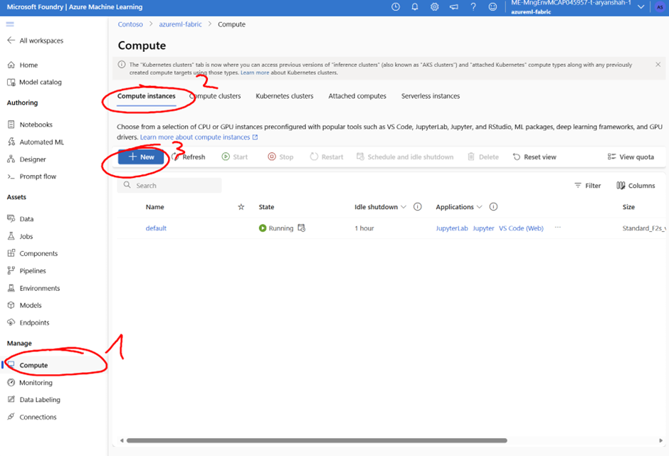
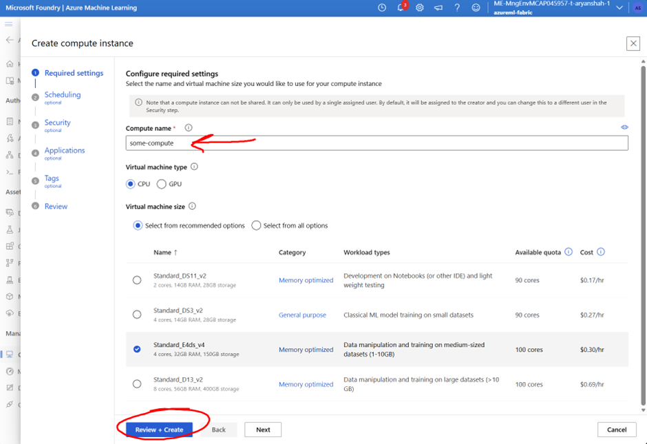
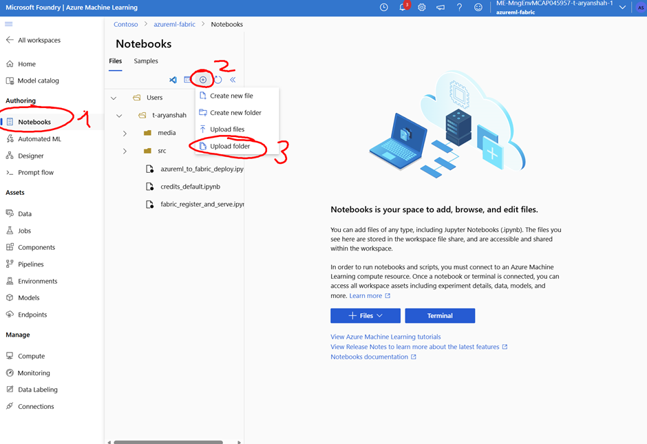
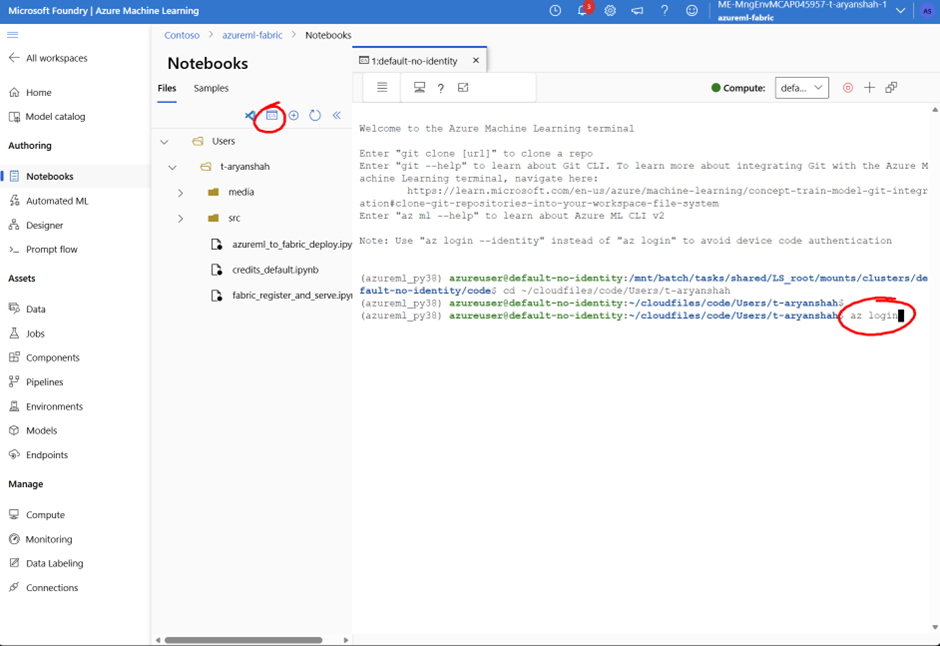
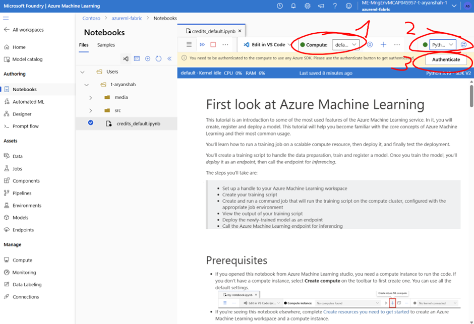
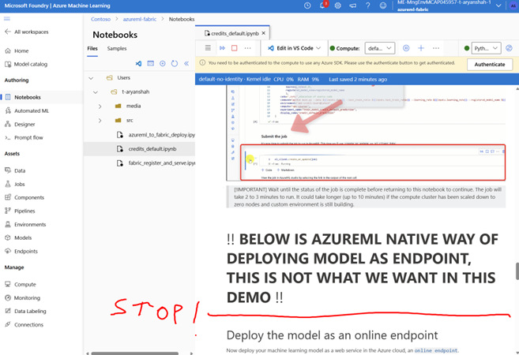
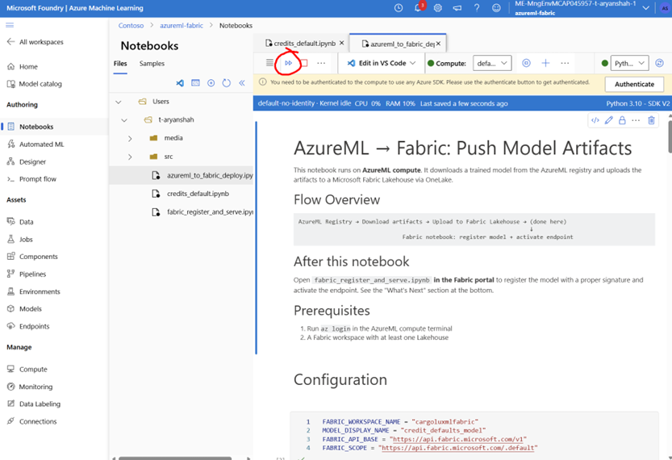
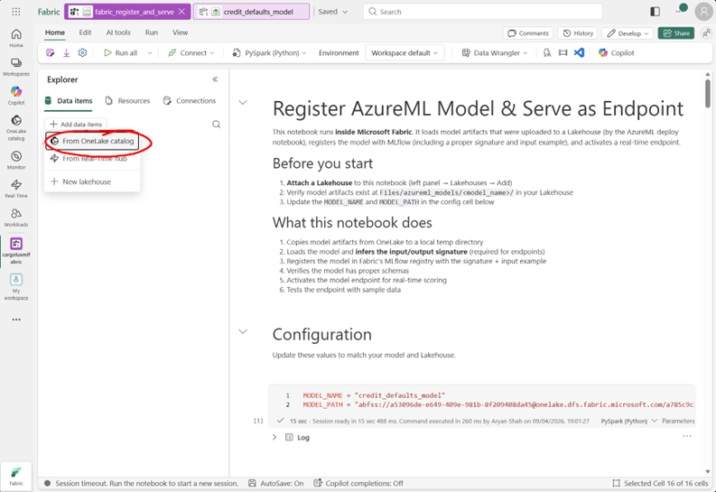
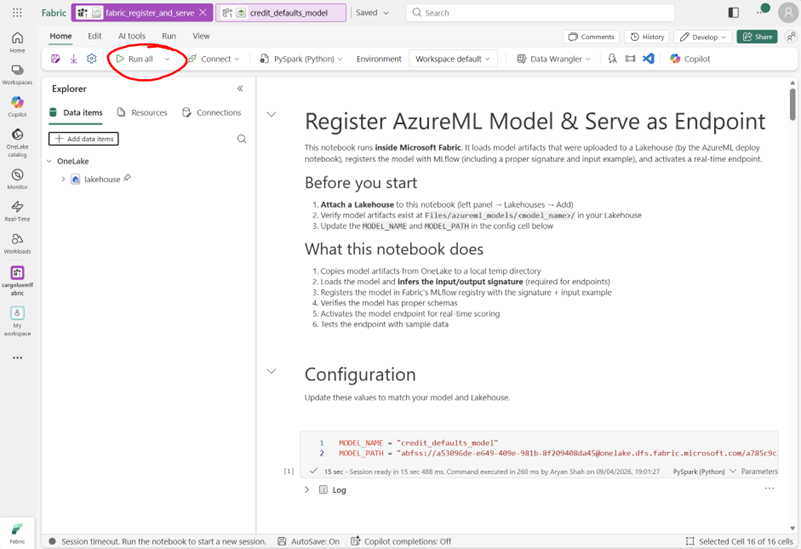
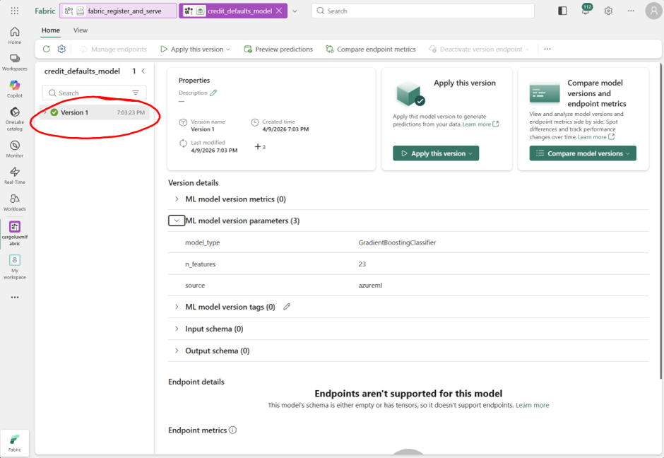

# Azure ML Model → Microsoft Fabric Endpoint (Via MLFlow)

Train a model on Azure ML with MLflow, then host it as an endpoint on Microsoft Fabric.

## Prerequisites

- Access to [Azure ML Studio](https://ml.azure.com)
- A Microsoft Fabric workspace with **Contributor** access (or higher)
- At least **1 lakehouse** available in your Fabric workspace (used to store model artifacts)

## Steps

### 1. Create a Compute Instance in Azure ML

Go to [ml.azure.com](https://ml.azure.com) → **Compute** → create a new compute instance.
No special configuration needed — fill in the required fields and click **Review + Create**.





### 2. Upload the Notebook Folder

Go to the **Notebooks** tab and upload the `upload_to_azureml` folder.



### 3. Authenticate with Azure CLI

Open a terminal in the compute instance and log in:

```bash
az login
```

This uses your Azure credentials to authenticate into the Fabric workspace.



### 4. Configure and Run the Training Notebook

Open `credits_default.ipynb`, attach the compute, and select **Python 3.10 SDK v2** as the kernel.



Run all cells **until** the section that says the following parts are for hosting the model as an endpoint **within AzureML** — skip that section (we're deploying to Fabric instead).



### 5. Deploy to Fabric

Open `azureml_to_fabric_deploy.ipynb` and run all cells. The notebook is documented inline.



> [!NOTE]
> This creates a notebook (`fabric_register_and_serve.ipynb`) in your Fabric workspace that you must trigger manually. The Fabric API does not yet support seamless automated notebook execution.

### 6. Run the Fabric Notebook

In your Fabric workspace, open `fabric_register_and_serve.ipynb`.

**Attach the lakehouse** where your model artifacts were stored.



Click **Run all**.



### 7. Verify

Once complete, find `credit_defaults_model` in your Fabric workspace to see the model and endpoint.



## Known Limitations

- The Fabric REST API does not yet support triggering notebooks programmatically (manual trigger required).
- Models trained on Azure ML and hosted on Fabric will not display full details in the Fabric UI (input/output schema, endpoint details, etc.).

## Disclaimer

> [!WARNING]
> This repository is an **unofficial** guide. It is provided "as is" without warranty of any kind. Use at your own risk. The authors and contributors assume no liability for any damages or issues arising from its use. See the [LICENSE](LICENSE) for full terms.
